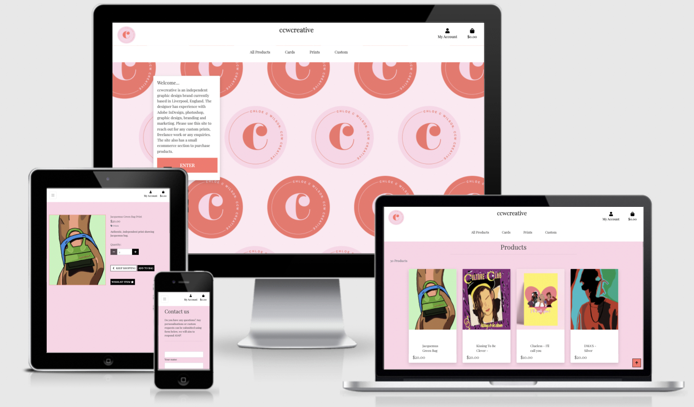
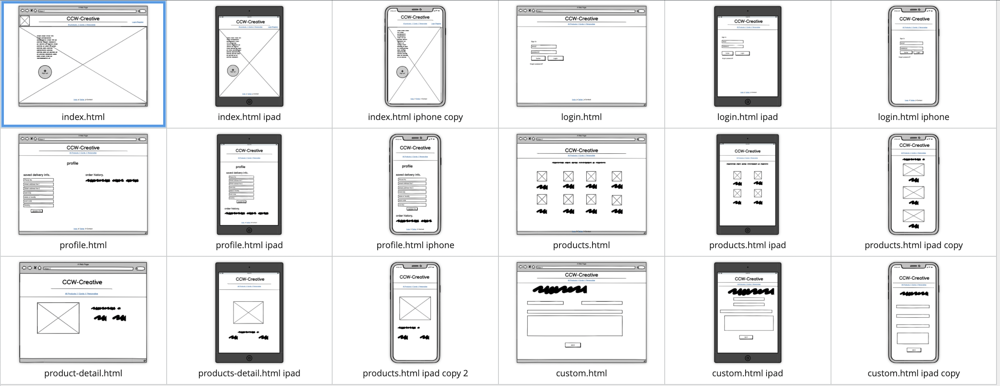
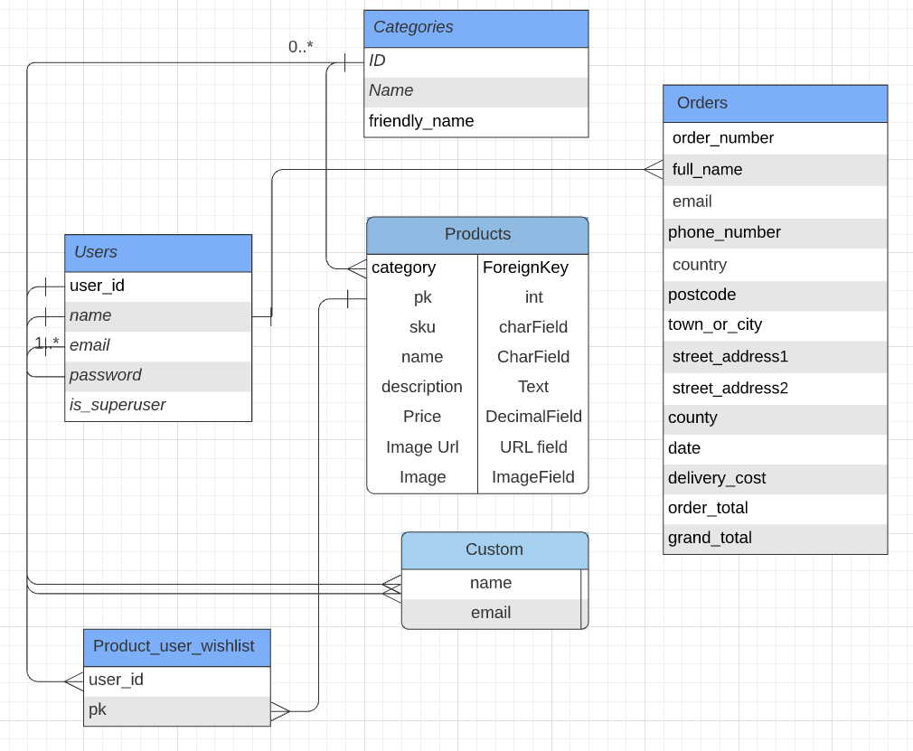

# ccwcreative

* Live Site Can Be Viewed [Here](https://ccwcreative.herokuapp.com/)

 ### Important!
 * Any secret key found in the commits is now obscelete and useless, this has been changed and added to an env file. 

## [Table of Contents]()
- [Project Goals](#Project-goals)

- [User Stories](#User-Stories)
  - [User Goals](#User-Goals)
    - [User](#User)
    - [Shopper](#Shopper)
    - [Returning User](#Returning-User)
    - [Site Owner](#Site-Owner)
    - [User Potential](#User-Potential)
  - [This App](#This-App)  

- [User Design](#User-Design)
    - [Strategy](#Strategy)
    - [Scope](#Scope)
    - [Future Scope](#Future-Scope)
    - [Structure](#Structure)

- [Design](#Design)
    - [Color Scheme](#Color-Scheme)
    - [Typography](#Typography)
    - [Imagery](#Imagery)
    - [Wireframes](#Wireframes)
    - [Data Schema](#Data-Schema)
  
- [Features](#Features)
- [Languages Used](#Languages-Used)
  - [Frameworks](#Frameworks)
  - [Libraries](#Libraries)

- [Deployment](#Deployment)
  - [Online Deployment](#Online-Deployment)

- [Testing](#Testing)

- [Credits](#Credits)

## Project Goals
 * The aim of this app was to deliver a simple and consise site focused on an independent graphic designer based in Liverpool. The site will have an about section to get to know more about the designer themselves, whilst also having an ecommerce section to purchase exsisting designs and products. CCW-Creative will be responsive on all devices focusing on mobile first design, also ensuring visitors have a consistent user experience. This site will be aimed at users who are like-minded and have an interest in graphic design, potential customer and also potentail employers who would like to hire the designer for freelance work. Users will have the option to create an account if they wish to purchase any products, this will be to save information for any future potential purchases. All of this readily available information will be displayed clearly and in hierarchy of importance on each page. The navigation bar, which allows you to readily access specific information on the site, interactive features, internal website links showing the user further information on specific sites. The project aims to give the graphic designer an opportunity to show case their current portfolio and provide a platform to grow and network with customers and likeminded peers. The site will have a contact form which will also act as a method of discussing any personalised designs a customer may want.

## User Stories

### User Goals

#### User

* As a user, I want to be able to access the website, regardless of the device I am using.
* As a user, I want my navigation options to be specific to whether I am logged in.
* As a user, I want to be able to easily navigate to other sections of the website regardless of the current section I'm viewing.
* As a user, I want my own personal account to keep a track of order history and to have my details saved.
* As a user, I want to be able to recover my password if it is forgotten so that I can reaccess my account.
* As a user, I want to recieve a confirmation email when I sign up, so that I know my registration was successful.
* As a user, I want the color scheme to be attractive and compliment the sites layout and images. 

#### Shopper

* As a shopper, I want to easily be able to view products
* As a shopper, I want to be able to view individual product details so that I can access more details about the product.
* As a shopper, I want to be able to view the total value of my current purchases at any time.
* As a shopper, I want to be able to edit the quantity of items I wish to purchase easily.
* As a shopper, I want to be able to sort the products by category.

#### Returning User
* As a returning user, I want to be able to log in to my account.
* As a returning user, I want to be able to see a list of my order history. 
* As a returning user, I want the site to save my default delivery information.
* As a returning user, I want the site to pre-fill the delivery information on the checkout page when purchasing a product.

#### Site Owner
* As a site owner, I want to be able to manage users, orders, products, and customers wishlists..
* As a site owner, I want to have superuser access to moderate the content.
* As a site owner, I want to receive emails to notify me of questions/custom request asked via the contact form.

#### User Potential 
* A user could be, someone who is looking to buy a small gift for a friend or relative.
* A user could be, someone who is looking for insipiration for their own artwork.
* A user could be, someone who is a sales rep looking for products to sell.

### This App
* Offers a clean, consise and simplistic journey creating a profile on an ecommerce site.
* Offers a means purchase products from an independent graphic desiger based in Liverpool, UK.
* Provides clear, simple information and details.
* Provides the option to contact the designer directly for any custom prints.
* This app is fully responsive.

## User Design

### Strategy
* With the main goal for this app to allow users to simply purchase products created by the designer, aesthetically pleasing and relevant  imagery will allow the user to focus on the content, without being distracted. 
* The design of the site needs to complement the content it is delivering.
* The 'Home' page allows users to read a small consise text box describing the purpose of this app and some brief background of the designer. 
* This website is aimed at users who want potentially puchase any products or want to support a local independant desiger. 
  There is no pressure to purchase any items. Moreover, there are different products for different types of customers.
* The wishlist allows users to save items they are a fan of but do not want to order at that particular time. This encourages the user to maybe return in the future.

### Scope
* Responsive website for any viewing device size.
* Responsive and interactive navigation bar.
* Relevant images showing all products mentioned on the app and useful details accompanying the product when clicked.
* Producing and interactive website with clickable features that allow the user to find further information about the different products.
* Internal page links that allow the user to navigate the website efficiently.
* User authentication to enure that users have there own personal history of orders and ensure details saved.

#### Future Scope
**Potential for future implementation**
* An 'About' section.
* A seciton that allows past customers to leave reviews.
* An interactive blog or newsletter.
* A rating system for products.
* User recieves email when they submit a custom request as well, instead of an alert from within the site. This gives the user a paper trail of the custom request.

### Structure
* Top level - 
    * Simple title with navigation in header. This will be responsive and across all pages of website. With links to main section of site.
* Body - 
    * Main elements found here, depicting important information, relavant to the current page user is on.
    * There will be button elements that enable the user to navigate the content easily and simply.
    * Dependent on the page, there will be images with accompanying information for the user to discover.
    * Dependent on the page there will be an interative form allowing a user to submit requests and enquires for custom prints. 

### Design

#### Color Scheme
* The color of the scheme of the site was decided by using natural pink and coral colors as this was specifed by the designer herself.
* The colors of #ff7369 & #fcd4e6, were agreed with the designer. These colors complement  the main and overall color dervived from the app theme. This color is neutral and allows text to be easily read. 
* Where suitable the color black was used for text & buttons against the light background, these are contrasting colors that allow the user to easily read the information.
* With a neutral background color, the information depicted would not be too contrasting on the site when loaded. 

#### Typography
* The font utilised for this app was the Playfiar font. This font has the serif typeface, therefore Sans Serif will be used as the fallback font in case there is an issue when importing the fonts, or browsers not supporting these. Font was imported via Google Fonts completement the simplicity of the design giving a visually pleasing user experience. This again, was also agreed with the designer.

#### Imagery
* Images used are all provided by the designer herself and all use of the images has been in agreement with the developer.  
* Font icons will be used throughout the website imported from [Font Awesome](https://fontawesome.com/). 
  These will be used to further emphasise the different sections of the website. 
  Using these icons adds a simple, effective and a subtle touch to the site that allows the user to understand what each section relates to. 
  The icons will be relevant to the different section headings of the site.

### Wireframes
* I Used Balsamiq to generate my Wireframes.

* The above wireframes represent all views of the site.

### Data Schema
* ERD was used to create my dataschema.

# Features
* Functioning Nav bar with working links.
* Responsive images.
* Buttons that utilise Jquery for further interactivity.
* User Authentication.
* Stripe Payment facilities.
* Regular shoppers are able to purchase products just like registered users but do not have the same benefits.
* The site owner is able to add, edit and delete products from the store.
  - If a product is uploaded without an image then a default image is provided.
* Each product has a name, SKU, category, description, stock and image.
* All users are able to filter any product in the store.
* There is a form that allows users to submit requests to the site owner, the user is also given an alert to confirm there 
  has been recieved.
* A custom form is also an option for users that have specific request for the designer.
* A wishlist functionality has been provided for user that wish to 'save' items they would maybe wish to purchase in the future. User authentication is needed for this function.

## Languages Used 
* HTML5
* CCS3
* JavaScript
* Python

### Frameworks
* Django 
* Bootstrap
* Font Awesome

### Libraries
* JQuery

* All dependancies can be found in the requirements.txt file.

### Git
* Was used for version control to commit to Git and push to Heroku.

### Heroku 
* Heroku was used in order to deploy the website.

### AWS 
* This was used to host all static files for the site.

# Deployment
* For this I used Gitpod to deploy my project.

* First create a heroku account and create a app - The name is up to you: mine was ccwcreative. Select a region closest to you - mine was Europe

* This assumes you already have a Stripe account.

* In heroku, under resources tab > Add-ons, search for postgress and add it. Select Hobby-Dev. as your plan - should be free

* Go to settings and ensure there is a variable called "DATABASE_URL"
* Product data needs to be imported

* In the terminal type python3 manage.py loaddata categories.json followed by python3 manage.py loaddata products.json
* Products depend on categories so order is important
  create a super user

* In the terminal type python3 manage.py createsuperuser
  follow the prompt in the terminal to create the superuser
* Create a Procfile for heroku

* The context of the file should be web: gunicorn [Main app].wsgi:application - my main app is Gymshop
* In the terminal run heroku login -i and login to your heroku account through the terminal

* In settings.py > ALLOWED_HOSTS > add the heroku app URL and local host:

* ALLOWED_HOSTS = ['[heroku app name].herokuapp.com', 'localhost']
* Push code to Heroku - Note static files are not visible

* initialize a heroku repository if not done so already
* Instructions for this can be found under the Deploy tab in heroku
* Add and commit using git
* Then git push heroku master
* Set up automatic deploys in heroku

* Deploy tab > Deployment method > Github > Search for the repository > Enable automatic deploys > master branch
* Set up a AWS account and initialise S3

* Create a AWS account at amazon web services
* My Account > AWS management console > Look for S3 - under recently visited service, the search bar or the find services search bar
* Create bucket > Enter bucket name and region - name should be the same as heroku and region should be closest to you > Disable "Block  public access"
* Acknowledge the bucket is public > Create bucket > Click on the bucket's hyperlink > Properties tab
* Scroll down to Static Website Hosting > Edit > Static Website Hosting - enable > Hosting Type - Host a static website > Fill out default values > Save
* Permissions tab > CORS configuration > add the following code and save:
[
    {
        "AllowedHeaders": [
            "Authorization"
        ],
        "AllowedMethods": [
            "GET"
        ],
        "AllowedOrigins": [
            "*"
        ],
        "ExposeHeaders": []
    }
]
* Permissions tab > Bucket Policy > Edit > Policy Generator > a new tab will open
  * Policy Type: S3
  * Effect: Allow
  * Principal: 
  * Actions : GetObject*
  * ARN: paste from previous tab
* Add Statement > Generate Policy > Copy the Policy > go back to the previous tab and paste it in
  * add /* at the end of the resource key > Save
* Permissions tab > ACL > Public access > Tick "List" under the objects column
* In the top Nav under Services > IAM > Groups > Create new group > name : manage-operation-gym > Next step > Next step > Create group
* In the side Nav click Policies > Create Policy > JSON tab > Import managed Policy > search for: "AmazonS3FullAccess" > import
* Create a list ([]) at the resource value and paste the ARN twice and append /* to the end of the second ARN (both are strings so "" is needed and need to be comma separated)
  * ["ARN", "ARN/*"]
* Next: tags > Next: Review > provide name and description > Create Policy
* Side Nav, click on Groups > manage-operation-gym > Permissions tab > Attach Policy > search and select the policy that was created > Attach Policy
* Side Nav, click on Users > Add User > enter a name for the user > Access type: Programmatic access > Next: permissions > Add user to Group > Next until the end > create user
* Download the CSV file from the success page > click Close

* Connect django to S3

   * In settings.py > change the following code:
     AWS_STORAGE_BUCKET_NAME = '[your bucket name]'
     AWS_S3_REGION_NAME = '[your region]'

   * Go to heroku > Settings > Config Vars > Add the following config vars:
      * AWS_ACCESS_KEY_ID - (value found in the CSV file)
      * AWS_SECRET_ACCESS_KEY - (value found in the CSV file)
    * Rebuild the app and see the files appearing the S3 bucket
    * Go to the S3 bucket > Create folder > name it media > upload the content of the media file > Set ACL public access to "read" in the objects column

* Create email functionality

In Gmail (due to its simplicity) got to Settings > See all settings > Accounts and import > other Google account settings
A new tab will open. In the side nav, click Security > turn on 2 step verification > App Passwords
"Select the app and device you want to generate the app password for" : other
Add a custom name > Generate
A window will appear with a key. Do not close this window. Copy the key to your clipboard
In the config vars of the heroku app create 2 variables:
EMAIL_HOST_PASS: The key generated by Gmail
EMAIL_HOST_USER: your email address where the key was retrieved from
In Heroku Config vars add your variables:

DATABASE_URL - Should already by provided by Postgress
DEVELOPMENT - Boolean - False
SECRET_KEY - Provided by Django
STRIPE_PUBLIC_KEY - Provided by Stripe - "Publishable key" on Stripe dashboard
STRIPE_SECRET_KEY - Provided by Stripe - "Secret key" on Stripe dashboard
STRIPE_WH_SECRET - Provided by Stripe - Developers > Webhooks > add an end point > select endpoint > Signing secret
log in to stripe Stripe > Side Nav, click Developers > Webhooks > add endpoint > the endpoint is [URL of deployed site]/checkout/wh/ > receive all events > add endpoint
Send a test webhook if this is successful. Sometimes it is slow to process this and a 401 error will appear but if you wait a few minutes it should work
Login to the deployed site's admin (/admin) with admin login details and then verify the admin account

Site is now fully deployed and is 100% functional

Offline/Local Deployment
In VSC , First clone the project from Github

 git clone https://github.com/ConorDavison/ccwcreative.git
Create a virtual environment in Windows. Navigate to where the project folder is and run:

     python -m venv venv
Activate the venv - Navigate to venv folder in the terminal window and inside run:

     C:\Python\Django_Project_Name\venv>Scripts\activate
If activation was successful, you should see the name of the virtual environment in curly braces in the front of the path:

      (venv) C:\Python\Django_Project_Name\venv>
Install packages needed for the project:

     (venv) C:\Python\Django_Project_Name> pip install requirements.txt
Create your superuser(admin)

     python manage.py createsuper
Run command:

     python manage.py makemigrations
Run command:

     python manage.py migrate
Create an env.py to store the env variables. The env variables needed for the project are: DATABASE_URL, SECRET_KEY, STRIPE_PUBLIC_KEY, STRIPE_SECRET_KEY, AWS_ACCESS_KEY_ID, AWS_SECRET_ACCESS_KEY, EMAIL_HOST_USER, EMAIL_HOST_PASS

You will need your own S3 bucket for storing media.

To generate a random key for SECRET_KEY, in CMD:

    >>>import secrets
    >>>secrets.token_hex(16)
    >>>'15412c9e3e3ff5e03cac2270cc6fb57f'
    >>>exit()

### How to run this project locally:

- Install the GitPod Browser Extension for Chrome.
- After installation, restart the browser.
- Log into GitHub or create an account.
- Locate the GitHub Repository.
- Click the "GitPod" button. This will trigger a new gitPod workspace to be created from the code in github where you can work locally.

### How to run this project within a local IDE, such as VSCode:

  - Log into GitHub or create an account.
  - Locate the GitHub Repository.
  - Under the repository name, click "Clone or download".
  - In the Clone with HTTPs section, copy the clone URL for the repository.
  - In your local IDE open the terminal.
  - Change the current working directory to the location where you want the cloned directory to be made.
  - Type 'git clone', and then paste the URL you have copied.
git clone https://github.com/USERNAME/REPOSITORY
Press Enter. Your local clone will be created.
(Further reading and troubleshooting on cloning a repository from GitHub here)

# Testing

## Functionality Testing
* Clicking on "My Account" > Register - takes the user to the registration form.
* Forcing URLs does not work as a unique key is attached to the link sent to the user.
* Forcing Other URLs will only generate the registration page, the login page and the home page.

## Combatability Testing
*  The site has been tested across multiple virtual mobile devices and browsers. I checked all supported devices in both Mozilla web developer tools and Chrome developer tools.

### Login
* Filling out the form successfully sends user to the home page and gives leaves them signed in.
* Unsuccessful submissions will result in errors being shown.
* Users are able to change their password if required.

### Logout
* Only a user that is logged in can use this
* Under "My Account" > Logout
* This takes users to a sign out page where they can click "Cancel" or "Sign Out"
* Clicking cancel redirects the user to the home page and they are still logged in
* Clicking sign out redirects the user to the homepage and they are logged out.

### Modifying/Adding to bag
* No errors when testing this functionality of the site. Customers can select quantity and update bag - grand total adjusts accordingly.

## Wishlist
* To access this feature a user must be logged in. Forcing URLS (not logged in) will result in a Sign in page appearing
* A signed in user can add a product to their wish list by clicking "Add to wishlist" - a success message will appear saying that the item  has been added to their wish list
* The Add to Wishlist button is available on the products page or the product's details page.
* A user is unable to add products through forcing URLs and will be redirected to the home page with a error message
* Modifying wishlist produced no errors or known bugs.

## Emails
* Emails have been tested via Tempmail.org. Confirmation email of purchase recieved successfully as well as email to verify new account.

## Google Lighthouse
I was reluctant to use google lighthouse as a means of testing due to reading it can be incredibly inconsistent. Nonetheless, I have included the scores from the generated report:-
  > Best Practices = 100
  > Performance = 89
  > SEO = 87
  > Accessibility = 73.

## Validators
* HTML was passed through a validator - the only error I recieved was that an ID that was in a loop had been used more than once, after reviewing slack I noticed this is an error that can occur, the solution on slack was to mention it within the READme. In fear of not wanting to damage the code as it runs currently this was what I have devided to do. 
* CSS was passed through the W3C validator. No errors.
* JS - Passed through JSHint with no major issues some warnings to advise certain synatx is available in 'ES6 (use 'esversion: 6')'.
* Python code has been passed through http://pep8online.com/, no concerns or errors.

# Credits
* Firstly, I would like to thank the graphic designer, Chloe Wilson, for trusting me to make this site using her products.
* Code Institutes gitpod template was used to initially set the project up.
* Code Institute for always being on hand to offer constructive advice when I faced any issues.
* I got the inspiration to make this project as I used some of the styling and functionality applied on it from code institute "Project - Boutique Ado"

